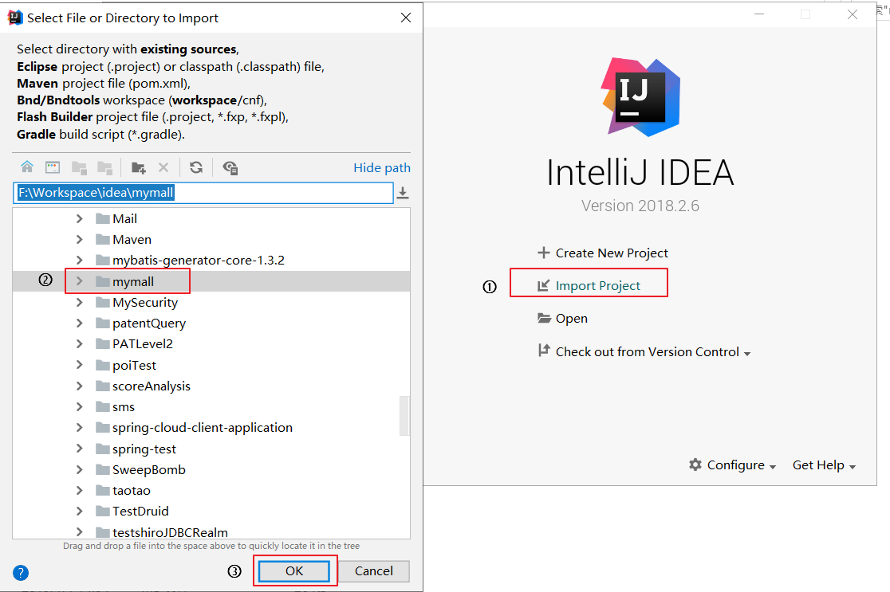
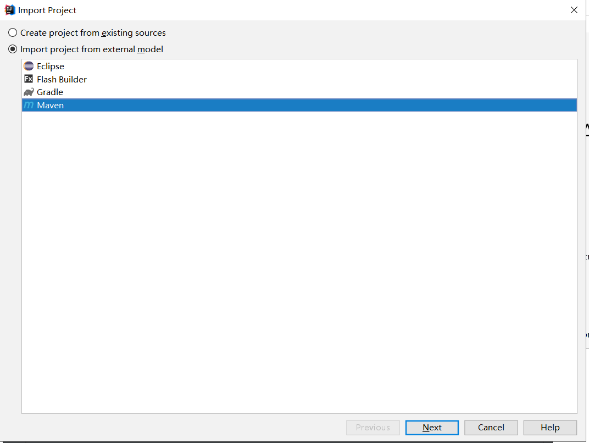
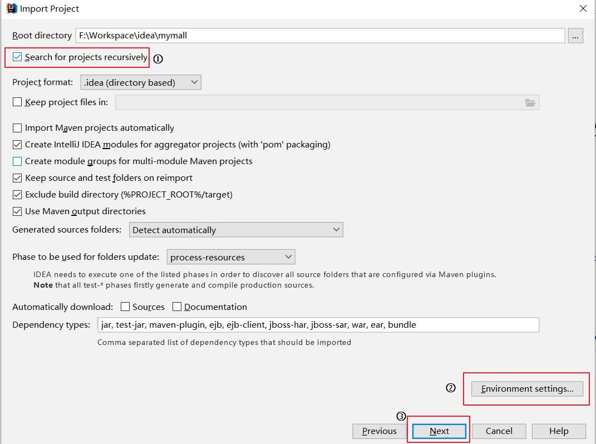
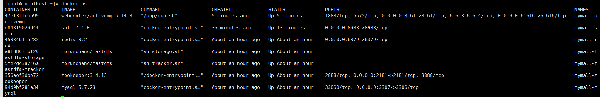
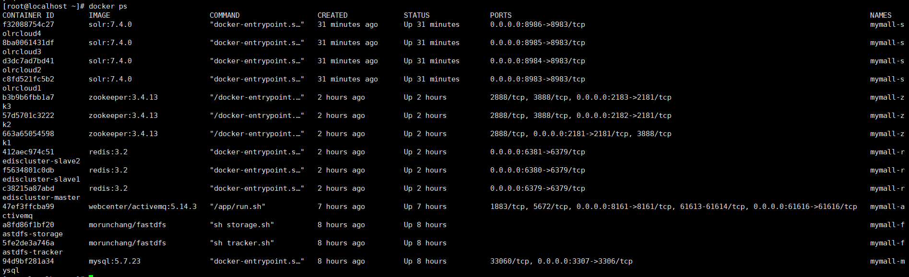
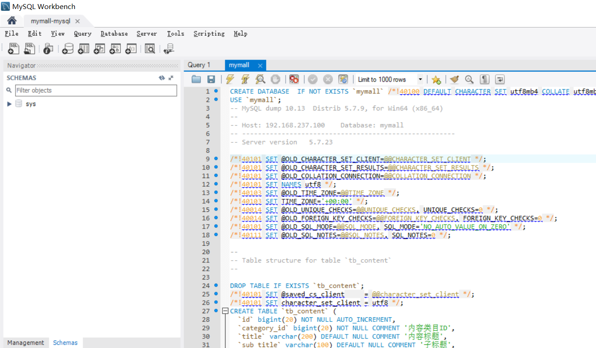
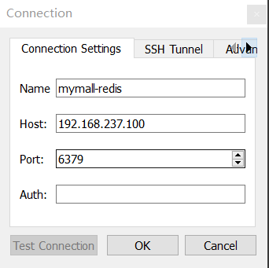
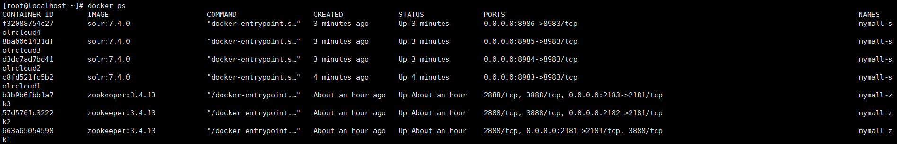
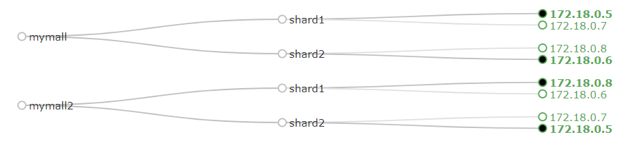

# 我的商城

                

本项目重新利用 `SpringBoot 2.0.4` 框架替代原始的SSM三大框架进行重构项目，采用 `Docker` 容器替代原本的虚拟机来进行项目的部署。

## 说明

在该原型系统中，计划运用相关的架构模式和开源框架，简要实现商城用户注册、登录、商城门户、搜索商品、查看商品详情页、添加购物车、确认订单以及后台相关资源、信息管理的核心流程。


核心流程系统演示：


### 序列图

系统部分序列图如下所示。

**用户登录**


**商品添加购物车**


**查看订单**


### 架构图

系统预期的部署架构图


## I. 导入工程

### 克隆代码仓库

```bash
git clone http://github.com/jahentao/mymall.git
```

### IDEA导入工程

1. 打开IDEA，选择导入项目，选中克隆的仓库本地所在目录；

   

2. 选择Maven进行导入；

   

3. 利用Maven导入项目前进行相关配置；

   

4. 然后选中所有模块进行导入即可，导入成功后可以浏览 Maven Projects 视图。


### 搭建运行环境

1. CentOS系统下安装 Docker；
2. 利用 Docker 安装MySQL、ZooKeeper、FastDFS、Redis、Solr 和 ActiveMQ。

登陆用户`visitor`，密码`123456`。

系统每次提交完订单后，重启之前，确保删除`order`相关信息，执行[SQL](delete_order.sql)，否则可能出现`Duplicate entry`错误。

注：具体参考[II. 项目配置](http://github.com/MrSorrow/mymall#ii-项目配置)部分。

### 修改配置文件

1. 修改项目所有的`*.yaml`和`*.conf`中的 *IP* 地址等；
2. 修改数据库连接用户名、密码。

### 启动所有模块

1. 启动容器实例；

    服务单节点情况下，至少启动的容器
    
    
    
    集群情况下，需要启动的容器

    

2. 启动所有Dubbo服务；

   | 服务                                                     | 模块     |
   | :------------------------------------------------------- | :------- |
   | cn.edu.zju.cst.sagroup.manager.ManagerServiceApplicationStarter | 后台     |
   | cn.edu.zju.cst.sagroup.content.ContentServiceApplicationStarter | CMS      |
   | cn.edu.zju.cst.sagroup.search.SearchServiceApplicationStarter   | 搜索     |
   | cn.edu.zju.cst.sagroup.sso.SsoServiceApplicationStarter         | 单点登录 |
   | cn.edu.zju.cst.sagroup.cart.CartServiceApplicationStarter       | 购物车   |
   | cn.edu.zju.cst.sagroup.order.OrderServiceApplicationStarter     | 订单     |

3. Windows宿主机启动Nginx。替换Nginx配置文件[nginx.conf](configure/nginx/nginx.conf)

    修改宿主机hosts。添加`mymall.com`等域名，详见[hosts](configure/hosts)
    
    解压[静态资源](configure/mymall-static/mymall-static.rar)和[上传的图片](configure/mymall-upload/mymall-upload.rar)分别至上文`nginx.conf`配置server的路径下。
    
    启动nginx。
    
4. IDEA中启动所有Web应用。如果访问`mymall.com`时跳转的不是Web项目页面，域名解析请求的DNS域名服务器，刷新也无效，可以断网再试试。

   | Web                                                  | 模块      | 地址                                             |
   | ---------------------------------------------------- | --------- | ------------------------------------------------ |
   | cn.edu.zju.cst.sagroup.manager.ManagerWebApplicationStarter | 后台      | [http://manage.mymall.com/](http://manage.mymall.com/) |
   | cn.edu.zju.cst.sagroup.portal.PortalWebApplicationStarter   | 首页      | [http://www.mymall.com/](http://www.mymall.com/) |
   | cn.edu.zju.cst.sagroup.search.SearchWebApplicationStarter   | 搜索      | [http://search.mymall.com/](http://search.mymall.com/) |
   | cn.edu.zju.cst.sagroup.item.ItemWebApplicationStarter       | 商品详情  | [http://item.mymall.com/](http://item.mymall.com/) |
   | cn.edu.zju.cst.sagroup.sso.SsoWebApplicationStarter         | 单点登录  | [http://sso.mymall.com/](http://sso.mymall.com/) |
   | cn.edu.zju.cst.sagroup.cart.CartWebApplicationStarter       | 购物车    | [http://cart.mymall.com/](http://cart.mymall.com/) |
   | cn.edu.zju.cst.sagroup.order.OrderWebApplicationStarter     | 订单      | [http://order.mymall.com/](http://order.mymall.com/) |
   | com.alibaba.dubboadmin.DubboAdminApplication         | Dubbo监控 | [http://localhost:7006/](http://localhost:7006/) |

## II. 项目配置

### 安装Docker

[CentOS 7使用脚本安装Docker CE](http://docs.docker.com/install/linux/docker-ce/centos/)；

```bash
# SET UP THE REPOSITORY AND INSTALL DOCKER CE
curl -fsSL http://get.docker.com -o get-docker.sh
sudo sh get-docker.sh
sudo systemctl enable docker
sudo systemctl start docker
# Manage Docker as a non-root user
sudo groupadd docker
sudo usermod -aG docker $USER
# log out and log back in
```

为方便起见，可以先关闭CentOS防火墙
```
systemctl stop firewalld
systemctl disable firewalld
```

### 安装MySQL

[MySQL镜像](http://hub.docker.com/r/library/mysql/tags/)；

1.  **单节点MySQL服务器配置，用于开发环境：**
   
   ```bash
   docker pull mysql:5.7.23
   ```

   启动MySQL容器（设置密码、端口映射）；

   ```bash
   docker run --name mymall-mysql -p 3307:3306 -e MYSQL_ROOT_PASSWORD=123456 -d mysql:5.7.23 --character-set-server=utf8mb4 --collation-server=utf8mb4_unicode_ci
   ```

   开启3306端口防火墙；

   ```bash
   firewall-cmd --zone=public --add-port=3306/tcp --permanent
   firewall-cmd --reload
   ```

   客户端（MySQLWorkbench）连接MySQL容器，并执行`mymall.sql`脚本导入数据。

   
   
2.   **MySQL集群配置，用于部署环境，以3台为例**


### Zookeeper 配置

Dubbo需要使用Zookeeper对分布式服务进行协调。

1. **单节点ZooKeeper配置**

    [拉取ZooKeeper镜像](http://hub.docker.com/_/zookeeper/)

   ```bash
   docker pull zookeeper:3.4.13
   ```

   启动ZooKeeper实例用于Dubbo的注册中心；

   ```bash
   docker run --name mymall-zookeeper -p 2181:2181 -d zookeeper:3.4.13
   ```

2. **Zookeeper集群配置**

   CNM 新建 Docker 自定义网络；

   ```bash
   [root@localhost ~]# docker network create mymall-zks
   8e3f9c7f672c38573609c294c7de5c13f69dbac1f03795bf415270ca4b07c41a
   [root@localhost ~]# docker network ls
   NETWORK ID          NAME                DRIVER              SCOPE
   bdb405aa48bf        bridge              bridge              local
   52dbb516d633        host                host                local
   dd5c9b3d1fb8        none                null                local
   8e3f9c7f672c        mymall-zks          bridge              local
   ```

   Docker 容器搭建 ZooKeeper 集群（3个实例）；

   ```bash
   # 启动实例1
   docker run -d \
        -v /usr/local/mymall-zks/zk1/data:/data \
        -v /usr/local/mymall-zks/zk1/datalog:/datalog \
        -p 2181:2181 \
        -e ZOO_MY_ID=1 \
        -e ZOO_SERVERS="server.1=mymall-zk1:2888:3888 server.2=mymall-zk2:2888:3888 server.3=mymall-zk3:2888:3888" \
        --name=mymall-zk1 \
        --net=mymall-zks \
        --privileged \
        zookeeper:3.4.13
        
   # 启动实例2
   docker run -d \
        --restart=always \
        -v /usr/local/mymall-zks/zk2/data:/data \
        -v /usr/local/mymall-zks/zk2/datalog:/datalog \
        -p 2182:2181 \
        -e ZOO_MY_ID=2 \
        -e ZOO_SERVERS="server.1=mymall-zk1:2888:3888 server.2=mymall-zk2:2888:3888 server.3=mymall-zk3:2888:3888" \
        --name=mymall-zk2 \
        --net=mymall-zks \
        --privileged \
        zookeeper:3.4.13
        
   # 启动实例3
   docker run -d \
        --restart=always \
        -v /usr/local/mymall-zks/zk3/data:/data \
        -v /usr/local/mymall-zks/zk3/datalog:/datalog \
        -p 2183:2181 \
        -e ZOO_MY_ID=3 \
        -e ZOO_SERVERS="server.1=mymall-zk1:2888:3888 server.2=mymall-zk2:2888:3888 server.3=mymall-zk3:2888:3888" \
        --name=mymall-zk3 \
        --net=mymall-zks \
        --privileged \
        zookeeper:3.4.13
   ```

   查看ZooKeeper集群搭建状态。

   ```bash
   # 宿主机执行命令 可能需要先安装nc(yum -y install nc)
   echo stat|nc 127.0.0.1 2181
   echo stat|nc 127.0.0.1 2182
   echo stat|nc 127.0.0.1 2183
   ```


### 图片服务器配置

1. 了解[Nginx](http://blog.csdn.net/bskfnvjtlyzmv867/article/details/80682470)与[FastDFS](http://blog.csdn.net/bskfnvjtlyzmv867/article/details/80714435)；

2. [拉取FastDFS镜像](http://hub.docker.com/r/morunchang/fastdfs/)；

   ```bash
   docker pull morunchang/fastdfs
   ```

3. 运行tracker实例；

   ```bash
   docker run -d --name mymall-fastdfs-tracker --net=host morunchang/fastdfs sh tracker.sh
   ```

4. 运行storage实例；

   ```bash
   # docker run -d --name storage --net=host -e TRACKER_IP=<your tracker server address>:22122 -e GROUP_NAME=<group name> morunchang/fastdfs sh storage.sh
   docker run -d --name mymall-fastdfs-storage --net=host -e TRACKER_IP=192.168.237.100:22122 -e GROUP_NAME=group1 morunchang/fastdfs sh storage.sh
   ```

5. 修改nginx的配置，[配置参考](configure/fastdfs/nginx.conf),不拦截上传内容；

   ```bash
   # 1. 进入容器
   docker exec -it mymall-fastdfs-storage  /bin/bash
   # 2. 编辑nginx配置文件
   vi /data/nginx/conf/nginx.conf
   # 3. 修改以下内容
   location /group1/M00 {
        proxy_next_upstream http_502 http_504 error timeout invalid_header;
        proxy_cache http-cache;
        proxy_cache_valid  200 304 12h;
        proxy_cache_key $uri$is_args$args;
        proxy_pass http://fdfs_group1;
        expires 30d;
    }
    # 4. 退出
    exit
    # 5. 重启storage容器
    docker restart mymall-fastdfs-storage
   ```

6. 开启防火墙 80、8080、22122、23000四个端口；

   ```bash
   firewall-cmd --zone=public --add-port=80/tcp --permanent
   firewall-cmd --zone=public --add-port=8080/tcp --permanent
   firewall-cmd --zone=public --add-port=22122/tcp --permanent
   firewall-cmd --zone=public --add-port=23000/tcp --permanent
   firewall-cmd --reload
   ```

7. 测试图片上传（创建配置文件、添加上传工具类 `FastDFSClient.java` 和测试类 `FastDFSTest.java`）。

   ```java
   @RunWith(SpringRunner.class)
   @SpringBootTest
   public class FastDFSTest {
       @Test
       public void testFastDfsClient() throws Exception {
           FastDFSClient fastDFSClient = new FastDFSClient("F:\\Workspace\\GitHub\\mymall\\mymall-manager\\mymall-manager-web\\src\\main\\resources\\conf\\fastdfs-client.conf");
           String file = fastDFSClient.uploadFile("F:\\Pictures\\Screenpresso\\1.png");
           System.out.println(file);
       }
   }
   ```

   

### 安装Redis

[了解 Redis 相关基础知识](http://blog.csdn.net/bskfnvjtlyzmv867/article/details/80834857)；

1.   **安装单机版Redis**

   [拉取Redis镜像](http://hub.docker.com/_/redis/)；

   ```bash
   docker pull redis:3.2
   ```

   启动Redis容器；

   ```bash
   docker run -d -p 6379:6379 --name mymall-redis redis:3.2
   ```

   开启6379端口；

   测试连接。

   

2.   **安装集群版Redis**（一主两备）

   [了解Docker容器 ***--link*** 参数的意义](http://www.jianshu.com/p/21d66ca6115e)；

   本地下载对应版本的redis压缩包（我是3.2的镜像），解压出 *redis.conf* 模板文件，拷贝三份 `redis-master.conf`、`redis-slave1.conf` 和 `redis-slave2.conf` 进行修改；

   ```properties
   # redis-master.conf 需要修改部分
   daemonize yes
   pidfile /var/run/redis.pid
   bind 0.0.0.0 # 原来是bind 127.0.0.1
   # redis-slave1.conf 需要修改部分
   daemonize yes
   pidfile /var/run/redis.pid
   slaveof master 6379 # 注释打开
   # redis-slave2.conf 需要修改部分
   daemonize yes
   pidfile /var/run/redis.pid
   slaveof master 6379 # 注释打开
   ```

   其中，`slaveof master 6379` 默认被注释，需要我们打开注释修改，master在这里充当 *ip* 的角色，后面利用 *--link* 参数来配置redis主机的别名为 *master*，用以让从机进行识别。

   创建redis集群容器，一主两备，备份机通过 *--link* 连接主机；

   ```bash
   docker run -it -p 6379:6379 -v /usr/local/redis/redis-master.conf:/usr/local/etc/redis/redis.conf --name mymall-rediscluster-master redis:3.2 /bin/bash
   docker run -it -p 6380:6379 -v /usr/local/redis/redis-slave1.conf:/usr/local/etc/redis/redis.conf --name mymall-rediscluster-slave1 --link mymall-rediscluster-master:master redis:3.2 /bin/bash
   docker run -it -p 6381:6379 -v /usr/local/redis/redis-slave2.conf:/usr/local/etc/redis/redis.conf --name mymall-rediscluster-slave2 --link mymall-rediscluster-master:master redis:3.2 /bin/bash
   ```

   其中，`/usr/local/redis` 目录是存放三个配置文件的目录，启动好一个容器可以 `Ctrl+P` 和 `Ctrl+Q` 进行退出创建下一个容器。

   启动redis服务。先启动 `master` ，然后启动 `slaver` 。在三个容器中都输入：

   ```bash
   redis-server /usr/local/etc/redis/redis.conf
   ```

   测试集群搭建情况。

   ```bash
   redis-cli
   127.0.0.1:6379> info
   ```

   

### Solr检索

[了解 Solr 服务相关基础知识](http://blog.csdn.net/bskfnvjtlyzmv867/article/details/80940089)

1. **安装单机版Solr**

   [拉取 *Solr* 镜像](http://hub.docker.com/_/solr/)；

   ```bash
   docker pull solr:7.4.0
   ```

   启动 *Solr* 容器，即可访问 http://192.168.237.100:8983/ ；

   ```bash
   docker run --name mymall-solr -d -p 8983:8983 -t solr:7.4.0
   ```

   新建 SolrCore，名称为 *mymall*；

   ```bash
   docker exec -it --user=solr mymall-solr bin/solr create_core -c mymall
   ```

   为了方便后续修改配置，将容器 solr 文件拷贝本地 `/usr/local/solr/`；

   ```bash
   docker cp mymall-solr:/opt/solr/ /usr/local/ # 容器拷贝宿主机
   ```

   设置中文分词 *smartcn*；

   - 进入容器 `docker exec -it mymall-solr /bin/bash` ；

   - 定位Solr7自带的中文分词器 *smartcn* 的jar包位置 `ls /opt/solr/contrib/analysis-extras/lucene-libs`；

   - 进入创建的 *solrcore: mymall* 配置目录 `/opt/solr/server/solr/mymall/conf`也就是拷贝出来的`/usr/local/solr/server/solr/mymall/conf`目录下 ，修改 `solrconfig.xml` ，参考[solrconfig.xml](configure/solr-single/solrconfig.xml)文件，添加 *smartcn* 包的 `lib` 标签；
      ```bash
      vi /usr/local/solr/server/solr/mymall/conf/solrconfig.xml
      ```
     

   - 在 `managed-schema` 中添加中文分词的 FieldType，参考[managed-schema](configure/solr-single/managed-schema)文件 ；
       ```bash
       vi /usr/local/solr/server/solr/mymall/conf/managed-schema
       ```
     

   - 上传配置，重启solr服务。

     ```bash
     docker cp /usr/local/solr/server/solr/mymall/conf/solrconfig.xml mymall-solr:/opt/solr/server/solr/mymall/conf/solrconfig.xml
     docker cp /usr/local/solr/server/solr/mymall/conf/managed-schema mymall-solr:/opt/solr/server/solr/mymall/conf/managed-schema
     docker restart mymall-solr
     ```

     
     
   
    solr中的索引可以通过API插入，后台管理系统提供了一键商品导入索引库的功能。

2.  **安装集群版Solr**

    需要先安装Zookeeper集群，详见上文。
    
    
   搭建 Solr Cloud（4个实例）；

   ```bash
   # 启动实例1
   docker run --name mymall-solrcloud1 --net=mymall-zks -d -p 8983:8983 solr:7.4.0 bash -c '/opt/solr/bin/solr start -f -z mymall-zk1:2181,mymall-zk2:2181,mymall-zk3:2181'
   
   # 启动实例2
   docker run --name mymall-solrcloud2 --net=mymall-zks -d -p 8984:8983 solr:7.4.0 bash -c '/opt/solr/bin/solr start -f -z mymall-zk1:2181,mymall-zk2:2181,mymall-zk3:2181'
   
   # 启动实例3
   docker run --name mymall-solrcloud3 --net=mymall-zks -d -p 8985:8983 solr:7.4.0 bash -c '/opt/solr/bin/solr start -f -z mymall-zk1:2181,mymall-zk2:2181,mymall-zk3:2181'
   
   # 启动实例4
   docker run --name mymall-solrcloud4 --net=mymall-zks -d -p 8986:8983 solr:7.4.0 bash -c '/opt/solr/bin/solr start -f -z mymall-zk1:2181,mymall-zk2:2181,mymall-zk3:2181'
   ```

   验证搭建结果，访问 http://192.168.237.100:8983/ 、http://192.168.237.100:8984/ 、http://192.168.237.100:8985/ 或 http://192.168.237.100:8986/；

   

   上传配置文件 conf 到 ZooKeeper 中心；

   ```bash
   docker exec -it mymall-solrcloud1 /opt/solr/server/scripts/cloud-scripts/zkcli.sh -zkhost mymall-zk1:2181,mymall-zk2:2181,mymall-zk3:2181 -cmd upconfig -confdir /opt/solr/server/solr/configsets/sample_techproducts_configs/conf -confname mymall-solrcloud-conf
   ```

   查询zookeeper集群是否包含配置文件；

   ```bash
   docker exec -it mymall-zk1 /bin/bash
   bash-4.4# ./bin/zkCli.sh -server mymall-zk2:2181
   Connecting to mymall-zk2:2181
   ---日志省略---
   [zk: mymall-zk2:2181(CONNECTED) 0] ls /configs/mymall-solrcloud-conf
   [currency.xml, mapping-FoldToASCII.txt, managed-schema, protwords.txt, synonyms.txt, stopwords.txt, _schema_analysis_synonyms_english.json, velocity, update-script.js, _schema_analysis_stopwords_english.json, solrconfig.xml, elevate.xml, clustering, _rest_managed.json, mapping-ISOLatin1Accent.txt, spellings.txt, xslt, lang, params.json]
   ```

   请求：[http://192.168.237.100:8986/solr/admin/configs?action=LIST](http://192.168.237.100:8986/solr/admin/configs?action=LIST)

   更新配置文件；

   ```bash
   # 拷贝宿主机修改的目录上传至solr集群中某一节点
   docker cp /usr/local/solr/server/solr/mymall/conf/solrconfig.xml mymall-solrcloud1:/opt/solr/server/solr/configsets/sample_techproducts_configs/conf/solrconfig.xml
   docker cp /usr/local/solr/server/solr/mymall/conf/managed-schema mymall-solrcloud1:/opt/solr/server/solr/configsets/sample_techproducts_configs/conf/managed-schema
   
   # 利用putfile命令更新集群的配置文件
   docker exec -it mymall-solrcloud1 /opt/solr/server/scripts/cloud-scripts/zkcli.sh -zkhost mymall-zk1:2181,mymall-zk2:2181,mymall-zk3:2181 -cmd putfile /configs/mymall-solrcloud-conf/solrconfig.xml /opt/solr/server/solr/configsets/sample_techproducts_configs/conf/solrconfig.xml
   docker exec -it mymall-solrcloud1 /opt/solr/server/scripts/cloud-scripts/zkcli.sh -zkhost mymall-zk1:2181,mymall-zk2:2181,mymall-zk3:2181 -cmd putfile /configs/mymall-solrcloud-conf/managed-schema /opt/solr/server/solr/configsets/sample_techproducts_configs/conf/managed-schema
   ```

   创建collection，分两片，每片一主一备。浏览器输入请求：

   - [http://192.168.237.100:8986/solr/admin/collections?action=CREATE&name=mymall&numShards=2&replicationFactor=2](http://192.168.237.100:8986/solr/admin/collections?action=CREATE&name=mymall&numShards=2&replicationFactor=2)
   - [http://192.168.237.100:8986/solr/admin/collections?action=CREATE&name=mymall2&numShards=2&replicationFactor=2&collection.configName=mymall-solrcloud-conf](http://192.168.237.100:8986/solr/admin/collections?action=CREATE&name=mymall2&numShards=2&replicationFactor=2&collection.configName=mymall-solrcloud-conf)

   

   重新载入ZooKeeper更新后的配置文件。

    [http://192.168.237.100:8986/solr/admin/collections?action=RELOAD&name=mymall](http://192.168.237.100:8986/solr/admin/collections?action=RELOAD&name=mymall)

    [http://192.168.237.100:8986/solr/admin/collections?action=RELOAD&name=mymall2](http://192.168.237.100:8986/solr/admin/collections?action=RELOAD&name=mymall2)

   在宿主机为Windows，容器跑在虚拟机中，Windows 需要配置路由，cmd需要管理员权限
    ```cmd
    route ADD 172.18.0.0 MASK 255.255.0.0 192.168.237.100
    # 查看
    route print 172.18.0.0
    ```
    这里的路由配置，其实没有得到预期的结果。看一些网上答案却并没有这种情况。
   
   
### 后台功能


   查询商品列表；

   

   新增商品选择类目（查询商品分类）；

   

   图片上传（Spring Boot读取自定义properties）；

   商品添加数据库。

### CMS系统


   查询、新增内容分类管理功能；

   分类进行查询、新增内容。

   

### 前台工程

   CMS系统新增首页轮播图内容并插入数据库；

   首页展示轮播图，添加redis缓存；

   

### 搜索服务

  配置业务域，修改方法类似配置中文分词器；参考[managed-schema](configure/solr-single/managed-schema)文件

   ```xml
   <field name="_id_" type="string" indexed="true" stored="true" required="true" multiValued="false" />
   <!-- docValues are enabled by default for long type so we don't need to index the version field  -->
   <field name="_version_" type="plong" indexed="false" stored="false"/>
   <field name="_root_" type="string" indexed="true" stored="false" docValues="false" />
   <field name="_text_" type="text_general" indexed="true" stored="false" multiValued="true"/>
   
   <field name="id" type="plong" indexed="true" stored="true" required="true" multiValued="false" />
   <field name="item_title" type="cn_text" indexed="true" stored="true"/>
   <field name="item_sell_point" type="cn_text" indexed="true" stored="true"/>
   <field name="item_price"  type="plong" indexed="true" stored="true"/>
   <field name="item_image" type="string" indexed="false" stored="true" />
   <field name="item_category_name" type="string" indexed="true" stored="true" />
   
   <field name="item_keywords" type="cn_text" indexed="true" stored="false" multiValued="true"/>
   <copyField source="item_title" dest="item_keywords"/>
   <copyField source="item_sell_point" dest="item_keywords"/>
   <copyField source="item_category_name" dest="item_keywords"/>
   ```

   

### 搜索前端


   利用 SolrJ 进行检索，发布搜索服务；

   

### 配置消息中间件ActiveMQ

   [拉取 ActiveMQ 镜像](http://hub.docker.com/r/webcenter/activemq/)；

   ```bash
   docker pull webcenter/activemq:5.14.3
   ```

   启动容器实例；

   ```bash
   docker run -d --name mymall-activemq -p 61616:61616 -p 8161:8161 webcenter/activemq:5.14.3
   ```

   宿主机开启防火墙端口8161和61616；

   访问 [http://192.168.237.100:8161](http://192.168.237.100:8161) 进入管理页面，默认登录账户密码均为 *admin*；

### 商品详情

   查询商品基本信息以及详情描述；

   为商品信息添加 Redis 缓存，设置缓存数据有效期为1天；

   利用 Thymeleaf 模板展示商品详情页面。

   

### 页面静态化

   利用 Thymeleaf 进行商品详情页面的静态化；

   引入 ActiveMQ 监听添加商品消息，并生成页面；

   利用 Nginx 服务器，实现静态页面访问。

### 单点登录

   用户填写的注册信息进行后台数据校验；

   用户登录、注册实现；

   利用 Redis 模拟SessionID 实现分布式系统 Session 同步共享（蓝底部分）；

   

   其他系统调用*SSO*服务根据 token 查询用户信息（跨域请求）。

### 购物车模块


   用户添加商品至购物车保存至 *Cookie*；

   从 *Cookie* 中取出商品列表，修改时更新 *Cookie*（购物车增删改查）；

   登录拦截器判断用户登录状态；

   用户登录后，利用Redis保存用户购物车信息，并与Cookie中进行合并。

   

### 订单系统

   利用 Redis 生成订单号；
   创建订单，保存至数据库。

### Nginx破坏性测试

  演示效果，我们在这里将利用Test Nginx image,将Nginx的镜像的Docker ID显示到前台页面
####  Demo图如下:
  