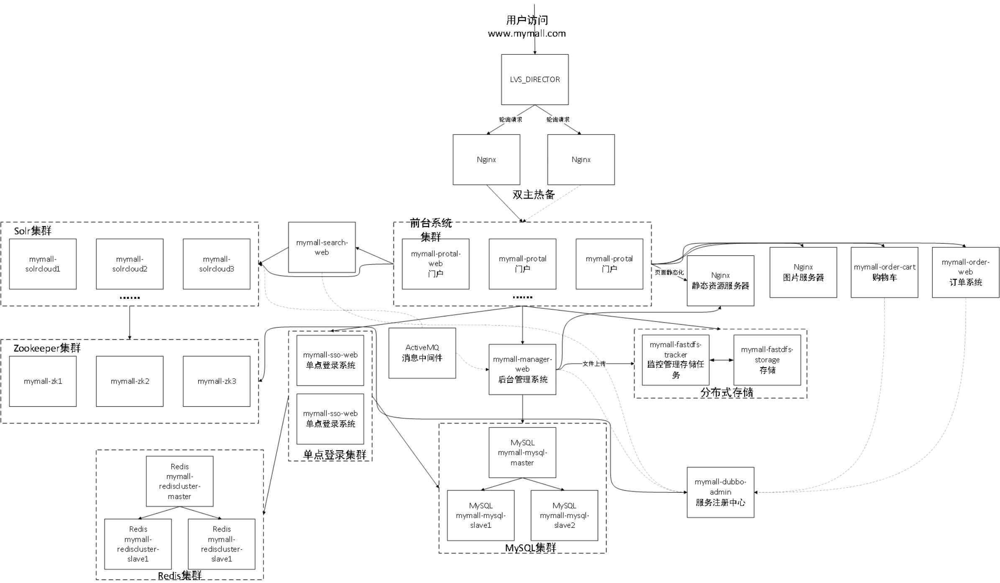
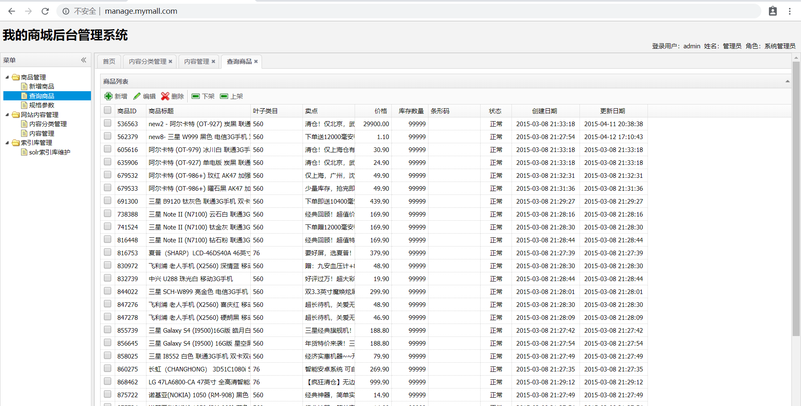
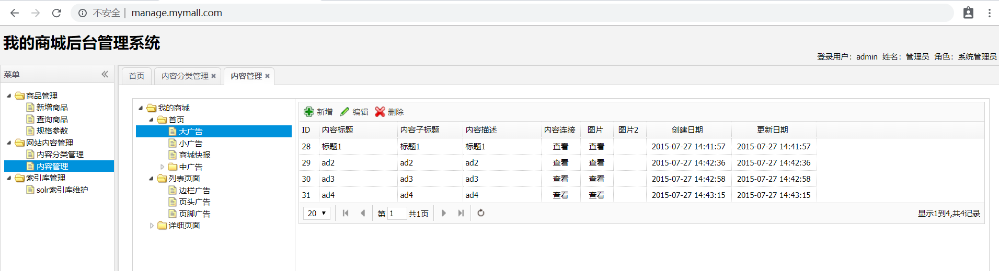
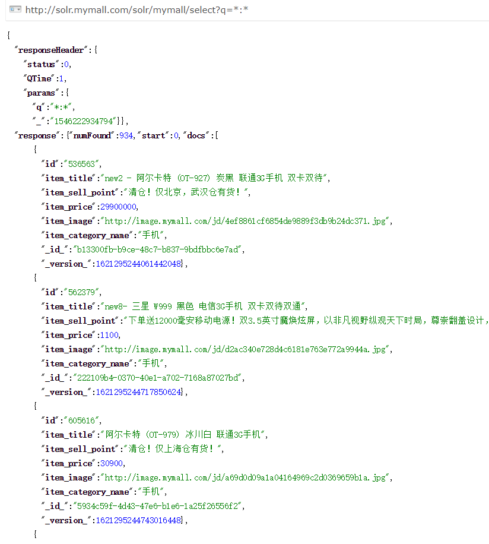
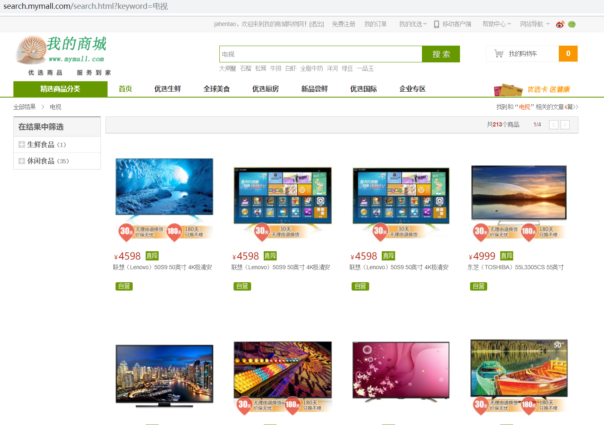
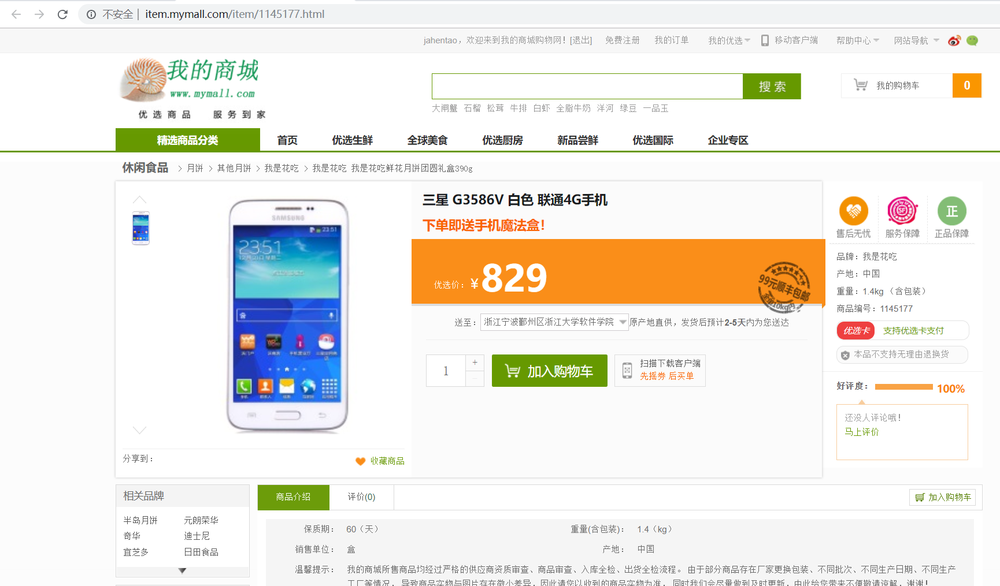
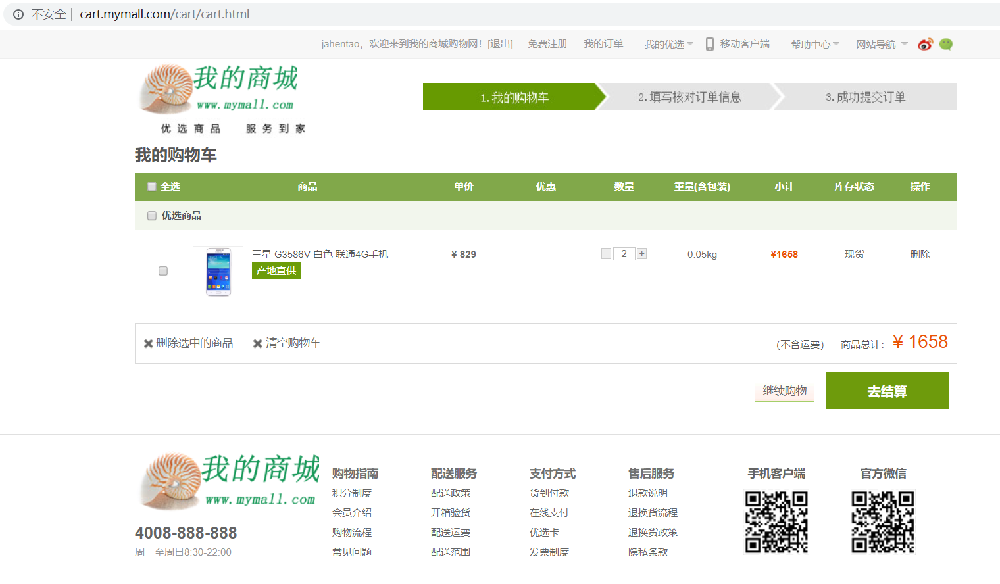

# 我的商城

                

本项目重新利用 `SpringBoot 2.0.4` 框架替代原始的SSM三大框架进行重构项目，采用 `Docker` 容器替代原本的虚拟机来进行项目的部署。

## 说明

在该原型系统中，计划运用相关的架构模式和开源框架，简要实现商城用户注册、登录、商城门户、搜索商品、查看商品详情页、添加购物车、确认订单以及后台相关资源、信息管理的核心流程。


核心流程系统演示：


### 概要设计

[数据库设计](design_db.md)

[UML图](design_uml.md)

### 架构图

系统预期的部署架构图




## 开发部署

详见[开发配置](development_configure.md)，包括：

- 安装Docker
- 安装MySQL
- 安装Zookeeper
- 安装FastDFS
- 安装Redis
- 安装Solr
- 安装ActiveMQ

## 各模块主要功能说明

### 后台功能

   查询商品列表；

   

   新增商品选择类目（查询商品分类）；

   

   图片上传（Spring Boot读取自定义properties）；

   商品添加数据库。

### CMS系统

   查询、新增内容分类管理功能；

   分类进行查询、新增内容。

   

### 前台工程

   CMS系统新增首页轮播图内容并插入数据库；

   首页展示轮播图，添加redis缓存；

   

### 搜索服务

  配置业务域，修改方法类似配置中文分词器；参考[managed-schema](configure/solr-single/managed-schema)文件

   ```xml
   <field name="_id_" type="string" indexed="true" stored="true" required="true" multiValued="false" />
   <!-- docValues are enabled by default for long type so we don't need to index the version field  -->
   <field name="_version_" type="plong" indexed="false" stored="false"/>
   <field name="_root_" type="string" indexed="true" stored="false" docValues="false" />
   <field name="_text_" type="text_general" indexed="true" stored="false" multiValued="true"/>
   
   <field name="id" type="plong" indexed="true" stored="true" required="true" multiValued="false" />
   <field name="item_title" type="cn_text" indexed="true" stored="true"/>
   <field name="item_sell_point" type="cn_text" indexed="true" stored="true"/>
   <field name="item_price"  type="plong" indexed="true" stored="true"/>
   <field name="item_image" type="string" indexed="false" stored="true" />
   <field name="item_category_name" type="string" indexed="true" stored="true" />
   
   <field name="item_keywords" type="cn_text" indexed="true" stored="false" multiValued="true"/>
   <copyField source="item_title" dest="item_keywords"/>
   <copyField source="item_sell_point" dest="item_keywords"/>
   <copyField source="item_category_name" dest="item_keywords"/>
   ```

   

### 搜索前端

   利用 SolrJ 进行检索，发布搜索服务；

   

### 商品详情

   查询商品基本信息以及详情描述；

   为商品信息添加 Redis 缓存，设置缓存数据有效期为1天；

   利用 Thymeleaf 模板展示商品详情页面。

   

### 页面静态化

   利用 Thymeleaf 进行商品详情页面的静态化；

   引入 ActiveMQ 监听添加商品消息，并生成页面；

   利用 Nginx 服务器，实现静态页面访问。

### 单点登录

   用户填写的注册信息进行后台数据校验；

   用户登录、注册实现；

   利用 Redis 模拟SessionID 实现分布式系统 Session 同步共享；
   
   其他系统调用*SSO*服务根据 token 查询用户信息（跨域请求）。

### 购物车模块


   用户添加商品至购物车保存至 *Cookie*；

   从 *Cookie* 中取出商品列表，修改时更新 *Cookie*（购物车增删改查）；

   登录拦截器判断用户登录状态；

   用户登录后，利用Redis保存用户购物车信息，并与Cookie中进行合并。

   

### 订单系统

   利用 Redis 生成订单号；
   
   创建订单，保存至数据库。


## 性能测试

[测试部分](performance_test.md)