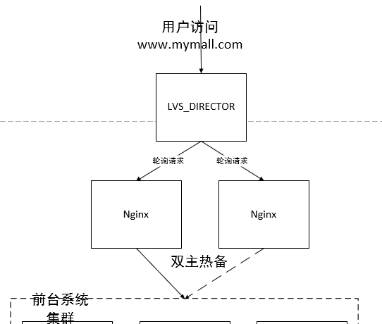
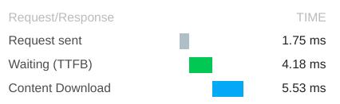

课设中，做了破坏性测试、首页压力测试、响应延时测试、读写分离性能测试等。

### Nginx破坏性测试

  Nginx破坏性测试，避免单点故障。

  LVS采取Direct模式，启动LVS和3台Nginx，请求会均衡地转发给3台Nginx，在网页上可以看到相应的container_id，当破坏性地kill掉1台Nginx，不会导致服务不能访问。

  
  
  演示效果，我们在这里将利用Test Nginx image,将Nginx的镜像的Docker ID显示到前台页面

####  Demo图如下:

  
  
### 首页压力测试

  在20s启动500线程循环10次，情况下jmeter压测结果
  
  1)  首页服务器单节点部署下的压力
  
  
  
  
  
  
  
  
  
  对比结论: 负载均衡后，错误率和响应时间都略有下降，但3台服务器所能承受的负载是高于1台的. （可能受到测试环境的影响， 不明显）

### 读写分离接口性能测试

  使用JMeter进行线程数为1000的接口性能测试:
  
  未进行读写分离：查询
  
  
  
  未进行读写分离：写入
  
  
  
  读写分离后：查询
  
  
  
  读写分离后：写入
  
  

  未进行读写分离前和读写分离后，查询请求的响应时间没有明显变化，但写入请求的响应时间明显改善。

### 页面静态化响应时间测试

  进行页面静态化前：
  
  
  
  进行页面静态化后：
  
  